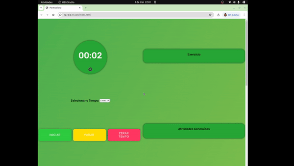

# Mini Projeto Pomodoro

Um aplicativo de temporizador pomodoro simples com recursos adicionais, como listagem de exercícios e marcação de exercícios concluídos.

## Funcionalidades

- Configuração do tempo do pomodoro.
- Iniciar, pausar e reiniciar o temporizador.
- Listagem de exercícios a serem realizados durante o pomodoro.
- Marcação de exercícios como concluídos.

## Tecnologias Utilizadas

- HTML
- CSS
- JavaScript

## API Utilizada

- API-Ninjas para buscar exercícios de alongamento.

## Instalação

1. Clone o repositório: git clone git@github.com:alanamandimifsc/Pomodoro-Exercise.git
2. Abra o arquivo index.html no seu navegador.

## Como Usar

1. Selecione o tempo do pomodoro no menu suspenso ou use o tempo padrão de 25 minutos.
2. Clique em "Iniciar" para iniciar o temporizador.

3. Durante o intervalo, os exercícios serão listados.

4. Ao concluir um exercício, clique em "Concluir" abaixo do exercício na lista.

## Licença e Configuração da API

Este aplicativo é distribuído sob a licença MIT. No entanto, observe que o uso da API-Ninjas para buscar exercícios de alongamento está sujeito aos termos de serviço da API-Ninjas. Para utilizar a API-Ninjas, você precisará criar uma conta em [API-Ninjas](https://api-ninjas.com/) e obter uma chave de API. Substitua a chave de API padrão no código pela sua chave pessoal obtida na API-Ninjas.

## Versão do Aplicativo

A versão atual do aplicativo é v1.0.0.

## Diretrizes de Contribuição

Contribuições são bem-vindas! Antes de enviar uma solicitação de recebimento, certifique-se de seguir estas diretrizes:

1. Abra um problema para discutir as mudanças que você gostaria de fazer.
2. Faça um fork do repositório e crie uma branch para suas alterações.
3. Certifique-se de manter o código limpo e aderir aos padrões de codificação.
4. Teste suas alterações.
5. Atualize a documentação, conforme necessário.
6. Envie sua solicitação de recebimento, descrevendo claramente as mudanças feitas.

Obrigado por contribuir!
